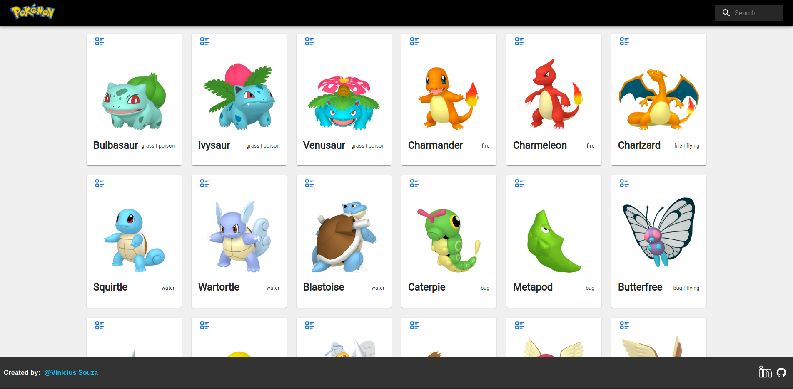

# PokeDex feita em React Js

# Descrição
- Projeto feito em React Js, com o objetivo de consumir uma API e listar os pokemons.
- O projeto foi feito com o intuito de praticar o consumo de API's e o uso de React Material UI.
- O codigo esta bem sujo,por conta que estou aprendendo React, mas estarei melhorando ele aos poucos.

# Observações
- A varios erros e bugs no projeto, mas estou trabalhando para corrigi-los.

# Imagens do projeto

# Tecnologias
- React Js
- React Material UI
- Axios
- Styled Components

# Como rodar o projeto
- Clone o projeto
- Rode o comando `npm start` ou `yarn start`

# Link do repositorio projeto no Github e no netlify
-[Github](https://github.com/Viniciusouza19/pokeDexReactJs)
-[Netlify](https://pokedexreactjsvinicius.netlify.app/)

# Autor
- Vinicius Souza

# Emojis e referencias para eventos de commit
- :art: quando melhorar a estrutura/formato do código
- :racehorse: quando melhorar a performance
- :memo: quando escrever alguma documentação
- :bug: quando corrigir um bug
- :fire: quando remover códigos ou arquivos
- :green_heart: quando corrigir uma build no CI
- :white_check_mark: quando adicionar testes
- :arrow_up: quando der upgrade em dependências
- :package: quando adicionar uma atualização

